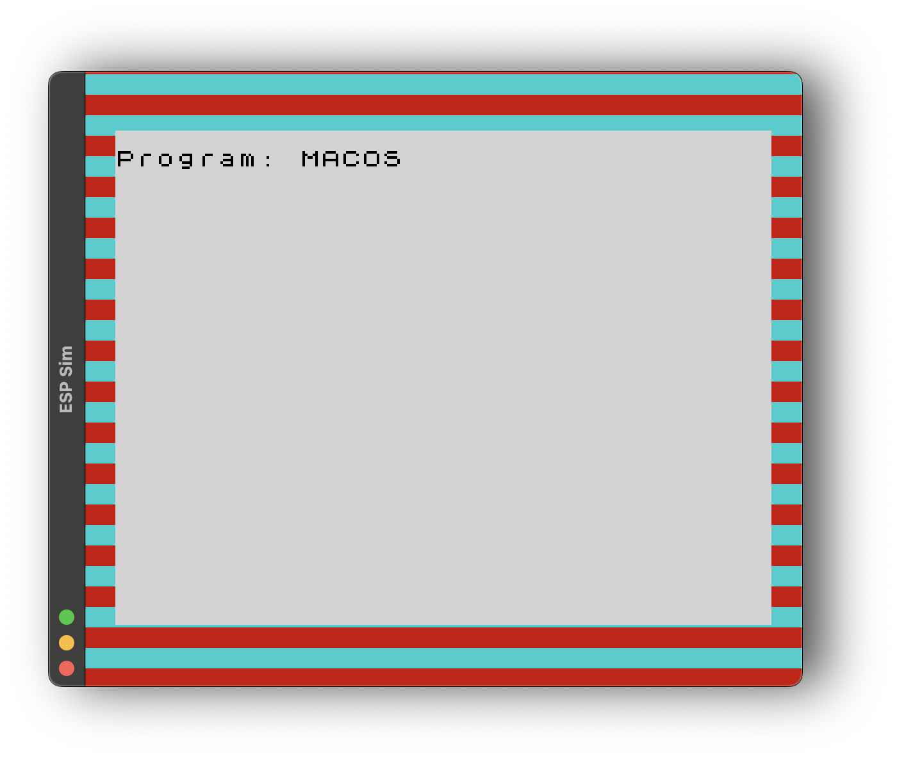
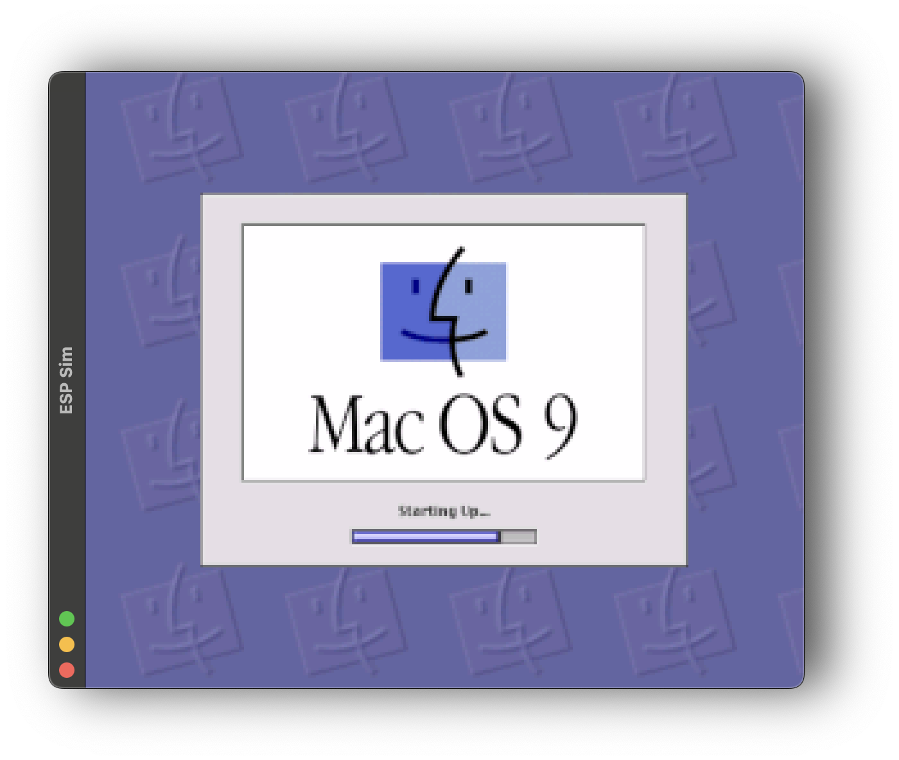
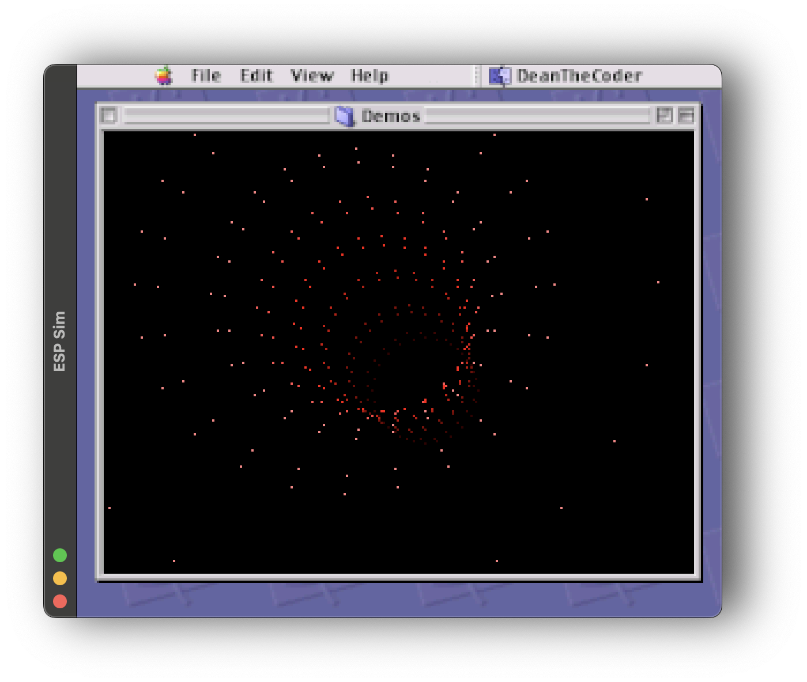
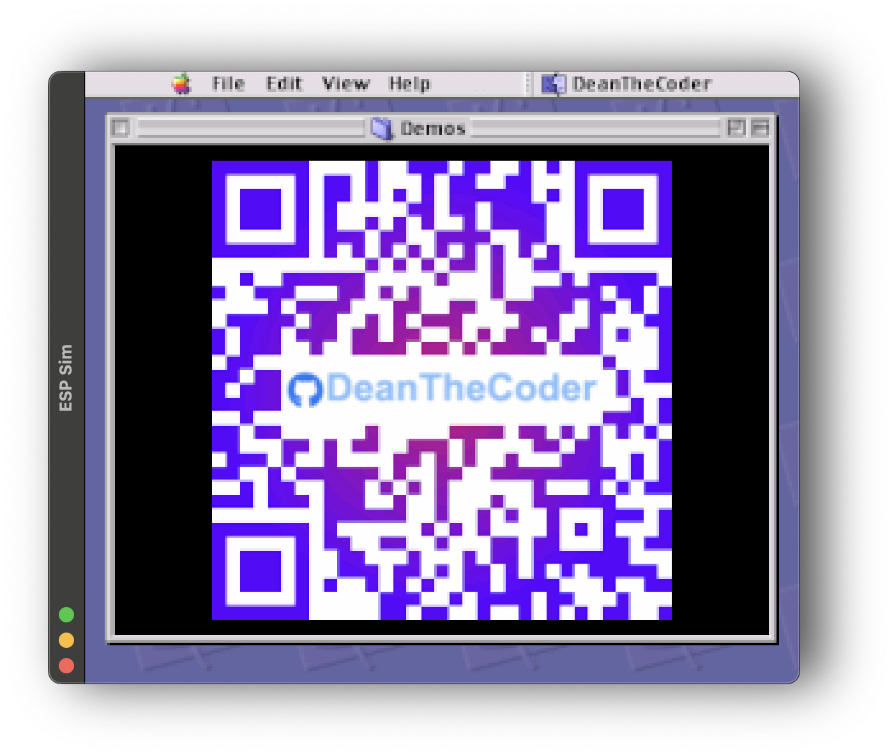
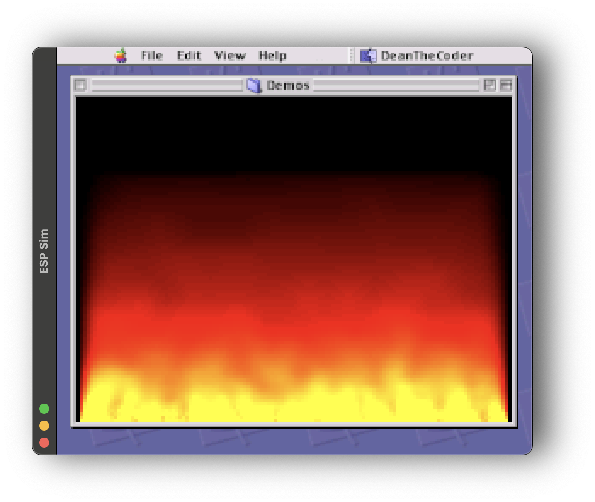
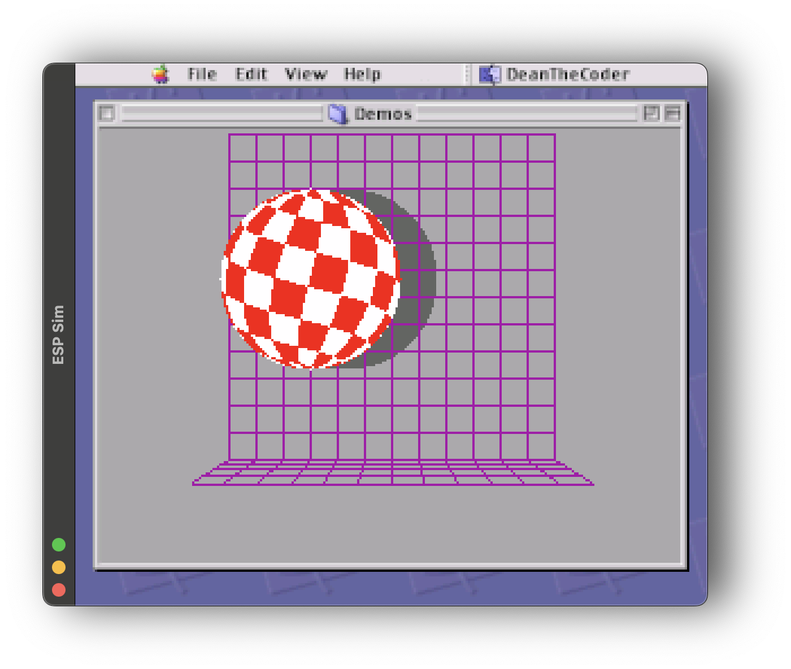
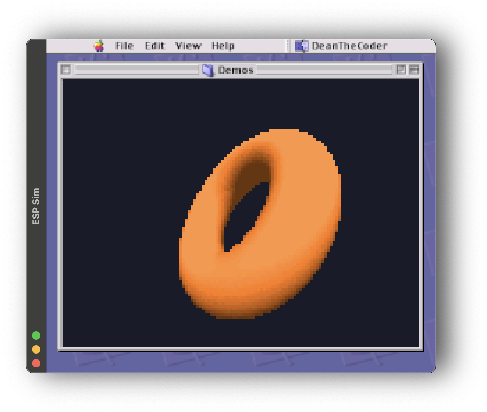
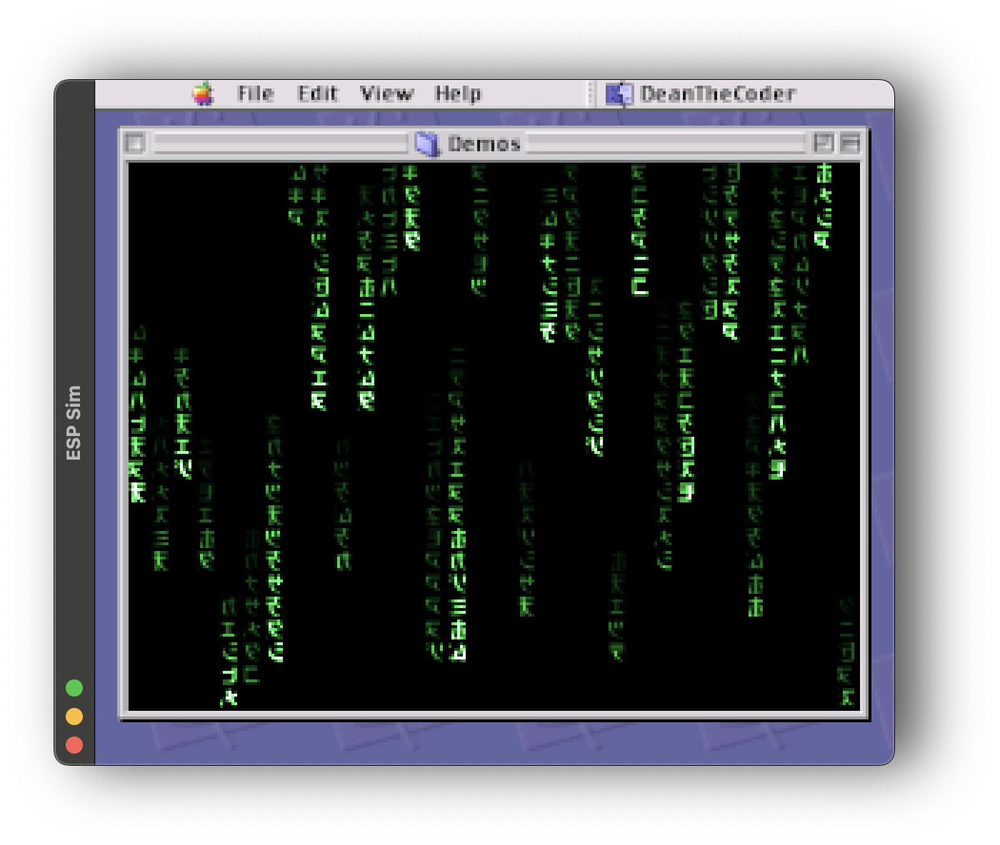
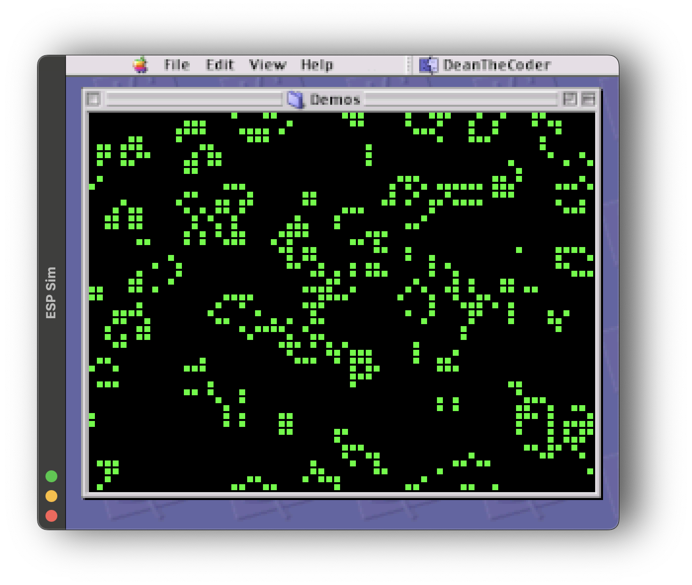
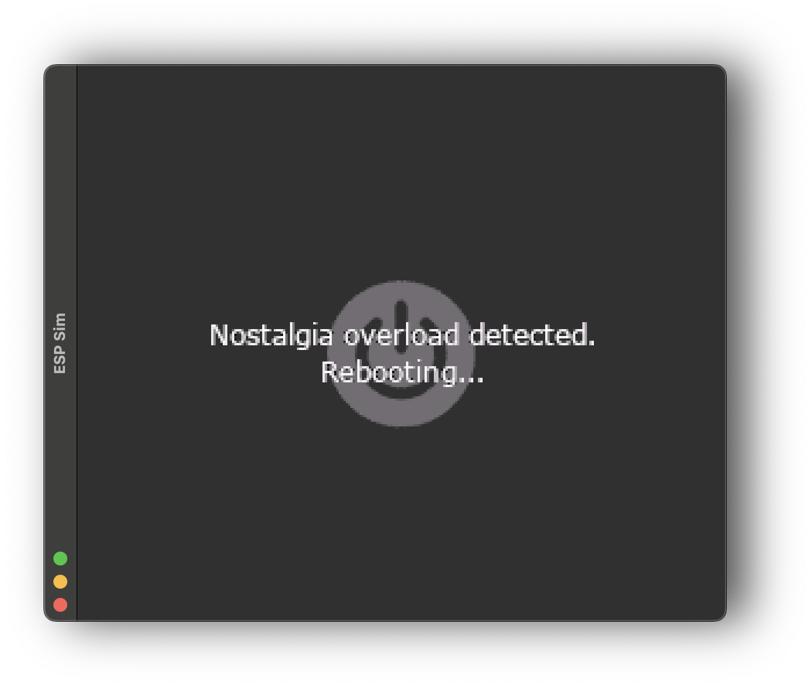

# 🧱 Brickintosh

A tiny Lego Macintosh powered by an ESP32-S3 + 1.69" LCD display.  
It looks like a Mac, boots as a ZX Spectrum, loads MacOS 8, and occasionally throws a kernel panic just to keep you guessing.  
Because why settle for one retro system when you can mash them all together?

Brickintosh is just me having fun with retro mashups — hope it makes you smile too.

---

## 🛠 Hardware

- [ESP32-S3 Dev Board with 1.69" IPS ST7789 LCD](https://thepihut.com/products/esp32-s3-development-board-with-1-69-lcd-display-240-x-280)  
- Lego bricks (to taste) for the iconic case.  

---

## 📦 Software

- [TFT_eSPI](https://github.com/Bodmer/TFT_eSPI) for LCD driving.  
- RGB565-encoded visuals.  

---

## 🖥 ESP_SIM

`ESP_SIM` is a simple `main.cpp` file that uses [SDL2](https://www.libsdl.org/) to emulate the output of the ESP32 device. This allows testing and code iterations quickly and easily on the desktop, before deploying to the actual hardware.

---

## 🚀 Build & Run

### ESP32

Build and flash the firmware using the Arduino IDE or PlatformIO with VS Code. Connect your ESP32-S3 device and upload the code directly to the hardware.

### ESP_SIM

To run the ESP_SIM emulator on your desktop, ensure you have SDL2 installed. Compile `main.cpp` using your preferred C++ compiler or build system in VS Code. Once compiled, run the executable to emulate the device output on your computer.

---

## 📸 Demo Screenshots

1. **Speccy loading sequence**

I wanted to nail that authentic ZX Spectrum vibe before switching things up, so this boots up exactly like the real deal.  I could have gone with an American Megatrends-style BIOS boot, but then I am a fan of the ZX Spectrum.  And what better than to make it look like the Speccy is loading MacOS?
     

2. **Loading MacOS**

I used a small bitmap for the progress bar, repeating the middle section so it grows as the bar extends.  
    

3. **Tunnel**

This simple pixel tunnel is just me playing around with some basic effects to get a nice sense of depth and motion.

It was the first effect I wrote, so gave me some experience of the screen rendering speed on the ESP32. Interestingly the speed was initially *painfully* slow, which I found was due to the graphics library rotating the display for me. From then on I took the rotation into account as I drew the screen content, so the library could use 'zero rotation'.
   

4. **DeanTheCoder QR code to GitHub site**

I made the QR code transition into a cloud of points, each following an x,y cos,cos curve (kinda like Lissajous plotting) with different multipliers and offsets.  
     

5. **Retro fire effect**

Rather than random seeds on the base line of the frame buffer, I drove the base line with fast-changing sin values to mimic smooth noise — it makes the gradient look nicer. At the end I just stop the seed line so the fire naturally fades away.  
     

6. **Amiga Boing Ball**

The original Amiga ball used a palette trick to fake the rotation. Here I went with actual UV calculations and rotation.  
   

7. **Spinning donut**

This one was painfully slow at first because of all the trig calls. I fixed that by precalculating what I could and adding lookup tables for sin/cos.  
   

8. **Matrix rain**

I borrowed the glyphs from Rezmason’s project and made the green code fall like in the movies, trying to capture that classic Matrix vibe.  
     

9. **Conway's Game of Life**

I love watching patterns evolve, so I implemented this cellular automaton to see life emerge right on the tiny screen.  
     

10. **Kernel panic**

I throw in a kernel panic just to keep things interesting and remind you this is all just a bit of fun.  
     

---

## 🙏 Acknowledgements

- [A1K0N](https://www.a1k0n.net/2011/07/20/donut-math.html) for Donut Math.  
- [Rezmason](https://github.com/Rezmason/matrix) for Matrix glyphs.  
- [Wikipedia](https://en.wikipedia.org/wiki/Conway%27s_Game_of_Life) for Conway’s Game of Life reference.